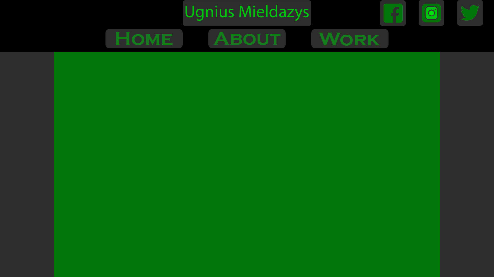

My digital portfolio is mainly made for an IT employer as it talks about me and my skills/interests and my cording/collage work.

|              | home | about | attributes | interests | hobbys | work | DofE | achievements |
|--------------|------|-------|------------|-----------|--------|------|------|--------------|
| home         | x    | x     | x          | x         |        | x    | x    | x            |
| about        | x    | x     | x          | x         | x      | x    | x    | x            |
| attributes   |      | x     |            |           |        |      |      |              |
| interests    |      | x     |            |           |        |      |      |              |
| hobbys       |      | x     |            |           |        |      |      |              |
| work         |      |       | x          | x         |        |      | x    | x            |
| DofE         |      |       |            |           |        | x    |      |              |
| achievements |      |       |            |           |        | x    |      |              |

all the assets i used for my website is listed below, the images are made by me that i made using adobe photoshop and the video is from level 1 that i made for one of the units.

https://www.youtube.com/watch?v=FlqWqc6QC1c

I have tested on two different websites and nothing breaks the only thing that changes is the loading speed of the images and video.

I have tested zooming in and out and making the screen bigger and smaller making it bigger makes some of the nav bars move up a bit and the text become smaller. making it smaller makes the texts become bigger but if you zoom in to much it breaks the nav bars.

I have included a lot of things about me like attributes, achievements, hobbys and work related things as the digital portfolio is aimed at employers so i added in as many things about me so the employer would know more about me.

May 10th - May 18th: I will work on my storyboard to get a design for my website.
May 18th - May 22nd: i will make any need images for my website like banners and anything else I need.
May 22nd - June 12th: I will start coding my website using the storyboard and use the images i have made.
June 12th - June 20th: I will start on the write up and start documenting my work.
June 20th: I will submit my unit and its is due on the 20th of June.